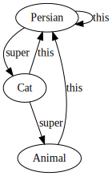

# Haskell can have a little Inheritance as a Treat

Inheritance is an infamously overloaded concept, with use-cases ranging over templating, ad-hoc polymorphism, code organization, method overriding, and even code reuse. Let us add a new one: Composable AST rewrites and queries.

The code can be found [in this gist](https://gist.github.com/Tarmean/c8c986f6c1723be10b7454b53288e989). I have some minor open design questions so it hasn't quite made it into a library yet.

### Open Recursion and V-Tables

OOP languages support open recursion, by which I mean the `super` and `this`/`self` references. Instead of calling static methods, objects carry vtables which contain function pointers. In most languages `super` links a vtable to the parent-class vtable, forming a linked list. Meanwhile `this` always points to the top-most vtable of the object:


*Every OOP example has to answer one important question: Cars or animals?*

Haskell can do vtables: We could pass around records of functions, or make GHC do the legwork by using type-classes. In fact, this is how GHC implements type-classes before optimizing them:

```Haskell
class Eq a => Ord a where
    compare :: a -> a -> Ordering
    (<) :: a -> a -> Bool
    ...
    
lessThan3 :: Ord Int => Int -> Bool
lessThan3 = (<3)

-- roughly translates to
data EqDict a = EqDict { (==) :: a -> a -> Bool }
data OrdDict a {
   superEq :: EqDict a,
   compare :: a -> a -> Ordering,
   (<) :: a -> a -> Ordering,
   ...
}

-- Here, `<` is a record selector which grabs the function from the `$dOrd` struct
lessThan3 :: OrdDict Int -> Int -> Bool
lessThan3 = \ $dOrd e -> (<) $dOrd e 3
```

Typeclasses are great because GHC optimizes them *hard*. Given enough INLINABLE pragmas it can replace most vtables with explicit calls. Additionally, the constraint solving executes a prolog-like logic program and can perform powerful code synthesis.  
But type-classes are hard to compose: They are fundamentally type driven, so we must transform the `super` and `this` pointers into unique types and parametrize all code over them. This optimizes well, but is really boilerplate heavy. Transformer stacks are bad enough to look at and we would need two stacks. Additionally, GHC occasionally hangs if we go overboard with cyclic typeclass dependencies when the constraint solver fails to memoize the cycles away.
Records of functions tend to be slower, but they are easy to work with.

Another probem is that open recursion is famously hard to reason about. To manage, we will restrict ourselves to a very limited form: We build a recursive function containing a case statement. The `super` pointers form a chain of possible cases, and `this` is the recursive call. 

This allows us to write queries and transformations over mutually recursive types, while only requiring a `deriving Data` on each type:

```Haskell
bottomUp :: Trans m
bottomUp =
   recurse >>> 
     (   tryTrans_ @Expr \case
              Minus x y
                | y == x -> Just (Lit 0)
              Plus (Lit 0) y -> Just y
              Plus y (Lit 0) -> Just y
              Plus (Lit a) (Lit b) -> Just (Lit (a + b))
              _ -> Nothing
      ||| tryTrans_ @Lang \case
              If (Lit i) a b -> Just (if i == 0 then b else a)
              _ -> Nothing
   )
```

We `recurse` first, so this is a bottom-up transformation: When we apply the rules, all sub-expressions are already transformed.
By abstracting over an applicative, queries are just a special kind of transform with a MonadWriter constraint:


```haskell
-- | Collect all references which are used but not bound in the code block
freeVarsQ :: Data a => a -> Set.Set Var
freeVarsQ = runQ
 (   tryQuery_ @Expr \case
       -- referencing variable is a use
       Ref v -> Just (Set.singleton v)
       _ -> Nothing
 ||| tryQuery @Lang (\rec -> \case
      -- But a bound variable it is not free
      Let {bindVar, bindExpr, bindBody} -> Just (rec bindExpr <> Set.delete bindVar (rec bindBody))
       _ -> Nothing)
     -- if no other branch matches, recurse into all sub-terms and add them up
 ||| recurse
 )
```

This query is similar to a recursion-schemes fold, where we flatten all child-terms using an algebra `(ExprF :+: LangF) a -> a`. But we have some advantages:

- By having a first-class function we can perform ad-hoc traversal orders, such as looping a transformation until the result stops changing
- We can work with mutually recursive types. We can throw all types into a sum as in datatypes ala carte, using `data (:+:) f g a = L (f a) | R (g a)`, but the transformation usually has to be hand-written.

### Typing the Data.Data

To implement this API, we will use the `Data.Data` approach to generic programming. It is notoriously slow, but we will add some optimizations. It is based on two key pieces:

- Data.Typeable constructs a unique `TypeRep` value for each type. We can use it to print types, compare types, and perform runtime casts
- Data.Data allows us to fold and unfold types generically

```Haskell
-- We can use Typeable to cast types at runtime
-- Internally, this compares the TypeRep's and performs an unsafeCoerce if they match
tryCast :: forall a b. (Typeable a, Typeable b) => (a -> String) -> b -> Maybe String
tryCast f x = case eqTy @a @b of
   Just Refl -> Just (f x) -- Here, type @a@ equals @b@
   Nothing -> Nothing -- Here they don't, @f x@ would be a type error!

-- We can use the `gfoldl` method in Data.Data to visit child terms
gmapM :: forall m a. (Data a, Applicative m) => (forall d. Data d => d -> m d) -> a -> m a
gmapM visitChild = gfoldl k pure
  where
    k :: Data d => m (d -> b) -> d -> m b
    reconstruct `k` focusedField = reconstruct <*> visitChild focusedField
```


Data.Typeable is quite magic and automatically derived by GHC for all types. We do not even get the opportunity for hand-written instances! For Data.Data we require a `-XDeriveDataTypeable` extension and an explicit `deriving Data`. There are good reasons to write these instances manually: For GADTs we usually have to. But even for normal types we may want to ban some constructors from being generated, or some fields from getting visited.

The `gfoldl` implementation has quite a confusing type signature. The idea is that we use a `z` function to wrap the constructor, and repeatedly apply a `k` function to visit each argument.
The `k` function can use the Data constraint to recurse further, and use the Typeable super-class to branch on the current type.

```Haskell
instance Data Lang where
    gfoldl :: (forall d b. Data d => m (d -> b) -> d -> m b)
           -> (forall g. g -> m g)
           -> Lang
           -> m Lang
    gfoldl k z (Bind a b c) = z Bind `k` a `k` b `k` c
    gfoldl k z (If a b c) = z If `k` a `k` b `k` c
    ...
```

## Implementation

Data.Data makes it easy to throw all transformations into one simple shape:

```Haskell
type Trans1 m = forall x. Data x => x -> m x

tryTrans1 :: forall a m. (Typeable a, Monad m) => (a -> m a) -> Trans1 m
tryTrans1 f (x :: tx) = case eqT @a @tx of
   Just Refl -> f x -- apply the transformation
   Nothing -> pure x -- keep the old value here
```

But it's not really composable yet. We need vtables! 

### A linked list of VTables

For transformations, we often want to distinguish between success and failure branches so we add two distinct continuations, similar to a search monad.

```Haskell
-- | VTable for our traversal
data Ctx m = Ctx {
  -- | Transformation when case matched
  onSuccess :: Trans1 m,
  -- | Transformation when case fails
  onFailure :: Trans1 m,
  -- | Top-level transformation for recursion on child-terms
  onRecurse :: Trans1 m
  }
```

A transformation now looks like `Ctx m -> Trans1 m`. As an optimization we also track some meta-data such as relevant types, so we can skip sub-types which are irrelevant to our transformation. I brazenly stole this trick from the lens library and only changed a couple line so that it works for multiple target types.

```Haskell
data Trans m = T {
    relevant :: !(S.HashSet TypeRep),
    toplevelRecursion :: Bool,
    withCtx :: Ctx m -> Trans1 m
}
```

This allows us to chain `Trans m` types sequentially or alternatively:

```Haskell
-- | Alternative composition of transformations
-- In @a ||| b@, we only run @b@ if @a@ fails.
(|||) :: forall m. Monad m => Trans m -> Trans m -> Trans m
l ||| r = T relevantTypes containsRecursion trans
  where
    relevantTypes = relevant l `S.union` relevant r
    containsRecursion = toplevelRecursion l || toplevelRecursion r
    trans :: Ctx m -> Trans1 m
    trans ctx = withCtx l (ctx { onFailure = withCtx r ctx })
infixl 1 |||

-- | Sequential composition of transformations
-- In @a >>> b@, we only run @b@ if @a@ succeeds.
(>>>) :: forall m. Monad m => Trans m -> Trans m -> Trans m
l >>> r = T relevantTypes containsRecursion trans
  where
    relevantTypes = relevant l `S.union` relevant r
    containsRecursion = toplevelRecursion l
    trans :: Ctx m -> Trans1 m
    trans ctx = withCtx l ctx{ onSuccess = withCtx r ctx }
infixl 1 >>>

-- Apply transformation to each child-term, always succeeds
recurse :: Monad m => Trans m
recurse = T mempty True $ \Ctx{..} -> onSuccess <=< gmapM onRecurse
```

And wrap simple transformation functions into `Trans`:

```Haskell
tryTrans :: forall a m. (Monad m, Data a) => (Trans1 m -> a -> Maybe a) -> Trans m
tryTrans f = T relevantTypes containsRecurions transformation 
  where
    relevantTypes = S.singleton (typeRep @a)
    containsRecursion = False
    transformation Ctx{..} (a::a') = Case eqT @a @a'
      Just Refl l -> case f onRecurse a of
           Just a' -> onSuccess a'
           Nothing -> onFailure a
      Nothing -> onFailure a
```

To run traversals we have to tie the context knot. Here, we finally use the collected meta-data to use the lens `hitTest` function:

```Haskell
runT :: forall m a. (Monad m, Data a) => Trans m -> a -> m a
runT trans a0 = f a0
  where
    Oracle oracle = hitTest a0 (relevant trans)
    ctx = Ctx { onSuccess = pure, onFailure = pure, onRecurse = f }
    f :: forall x. Data x => x -> m x
    f x = case oracle x of
      -- When the type is relevant, apply the transformation
      Hit _ -> withCtx trans ctx x
      -- If the type contains relevant types
      -- and the transformation would `recurse`, recurse
      Follow 
        | toplevelRecursion trans -> gmapM f x
      -- otherwise short-cicuit
      _ -> pure x
```


## Conclusion

I  accidentally re-discovered this pattern several times and have found it incredibly useful for quickly prototyping transformations. 
I also have not seen it in the wild before and figured others might find it useful.

However, I have not done much benchmarking. The HitTest optimization seems to help, but a thorough comparison against handwritten traversals would be nicer. I also have two open design questions:

- `recurse` should only count as a success if the result differs from the original value. Some monad transformer should handle this, but I have not found a nice way to make this composable with user monads yet
- The `HitTest` implementation can break if users call the function at new types. Given `tryQuery @[Int] (\rec ls -> rec (head ls, last ls))`, the recursive call at `(Int, Int)` may be unknown. I changed the implementation to always visit unknown types, but could we do something smarter?

If anyone has ideas I'm all ears! There is a reason fast OOP languages tend to run with a JIT compiler - specializing the indirect calls away could make this as fast as hand-written code.  The [Optimizing SYB is easy!](https://ku-fpg.github.io/papers/Adams-15-OSTIE/) paper may work, though I would be very surprised if Hermit (the GHC transformation DSL it was written in) still builds cleanly.

Thanks for reading!

