# Abstracting over Branch and Bound

## Introduction

[Wordle](https://www.powerlanguage.co.uk/wordle/) is a Mastermind-like browser game where you guess five-letter words. The game answers which letters are correct, in the wrong position, or flat out wrong. You have 6 guesses to win. This is a great balance because most people win most of the time, but I still feel like an absolute genius whenever I do.  
Here is an interesting meta-puzzle: What is the optimal Wordle strategy? We can figure this out with Branch and Bound (BnB). BnB describes a class of algorithms I hadn't heard of for the longest time, probably because the literature tends to be *really* vague.

Maybe I should mention my final solution ended up being in Rust because it turned out immensely easier to write memory-efficient code there. The first Haskell version took 20GB+ of memory, Rust using bitsets used 50MB. But while reimplementing the code I really wanted to abstract over the pruning search. And I came up with a hacky approach - but it only works in Haskell. This post is a brief sketch of this approach.

All descriptions of BnB I could find concur on the following steps:

- We have some representation for subproblems
- We can split unsolved subproblems into smaller subproblems
- We can prune some subproblems which won't lead to an optimal solution

Admittedly that's more concrete than "we use computers and algorithms to find a solution", but not by much. So I will focus on one specific type of pruning which can be found in most BnB implementations:

- We try to give subproblems a minimum and maximum cost
- If we have two subproblems `a` and `b`, when `max_cost(a) < min_cost(b)` then we can prune `b` because we know it won't lead to an optimal solution

Much more concrete, and quite close to alpha-beta-pruning for game trees. For solved subproblems the `max_cost` and actual cost coincide so we don't have to bother writing a `max_cost` heuristic - we can use the smallest finished solution found so far. All intuitions about `A*` heuristics work for `min_cost` because it's the same idea, turns out `A*` can be seen as a BnB algorithm. Beyond these basics we could use search strategies other than depth first, use smarter goal expansion, and add further filtering like plane cutting or dominance pruning. For today lets stick to the basics, though.

## In Haskell

To abstract over all this in Haskell we will use a monad transformer. We can express alternatives with the `Alternative` typeclass, `a <|> b`. Sequential steps naturally fit as a monad. The monad can keep track of the *slack* we have left - whenever we emit a cost we reduce the slack, once we go below `0` we can prune the current computation:

    newtype Bound s a = Bound { unBound :: StateT s [] a }
        deriving (Monad, Applicative, Alternative, Functor, MonadState s, MonadFail)
    class Monad m => MonadBound s m where
        tellCost :: s -> m ()
    class Slack s where
        dropSlack :: s -> s -> Maybe s
        addSlack :: s -> s -> s

    instance Slack s => MonadBound s (Bound s) where
        tellCost cost = do
            slack <- Bound get
            case dropSlack slack cost of
               Nothing -> empty
               Just slack' -> Bound (put slack')

To keep things interesting I will add another constraint, supporting the following optimization:  
If we can split our subgoal into `n` independent steps `child_1...child_n`, then we can give a better (i.e. lower) slack value:

    min_costs = children.map(min_cost)
    child_slack[i] = slack - (sum(min_costs) - min_costs[i])

In words, to compute the slack for subgoal `i` we can safely substract the `min_cost` of all other independent subgoals from the current slack in advance. This often gives us a much better estimate! Thankfully Haskell has a typeclass for independent steps (`Applicative`) and a language extension to rewrite Monadic code to Applicative steps (`-XApplicativeDo`). The extension is mostly used for implicit parallelism, but collecting as much `min_cost` information as possible works perfectly fine.  
However, wiring this cost information and monadic flow up sounds complicated. Instead we will build a stack of monad transformers that each have narrow purposes. For real code we probably would want to inline everything as a final step because deeply nested monad transformers do not optimize well.

### Memoization (planning stages)

As a final complication I want to support memoization. This makes the slack computation harder because cost might be context-sensitive. Lets use Wordle as an example. For the following tree our total cost is `1+2+3+2+3+3=14`.

If we use this cached tree in another position, and this position is at depth `3`, then we must update the cost to `4+5+6+5+6+6=32`! We can work around this by splitting context, cost, and slack into three types:

    newtype WordleSlack = WSlack Int
    instance Slack WordleSlack where
        addSlack = coerce (+)
        dropSlack (WSlack l) (WSlack r)
          | leftover >= 0 = Just (WSlack leftover)
          | otherwise = Nothing
          where leftover = l - r

    class (Slack s, Monoid o) => Cost c o s where
        inContext :: c -> o -> s

    data WordleCost = WCost { totalCost :: Int, nodeCount :: Int }
      deriving Monoid via (Sum Int, Sum Int)
      deriving Ord
    newtype WordleContext = Depth Int

    instance Cost WordleContext WordleCost WordleSlack where
        -- adjust for the cost of shifting `nodeCount` nodes down by `depth`
        inContext (Depth depth) (WCost {totalCost, nodeCount}) = WSlack (totalCost + nodeCount * depth)

Now we can build our next monad transformer. Annoyingly, slack must be global because we want to adjust it for future passes whenever we find a new and better solution. Context could live in a `ReaderT` monad, and `Cost` in a `WriterT`, but we will put them in a single `StateT` to simplify things later on. `Stream` is some version of `ListT`-done-right.

    newtype BoundM c o s m a = BoundM { unBoundM :: StateT (c,o) (Stream (StateT s m)) a }

We also need a monad to track the minimum of every `Applicative` branch we can see, and we do this using a fake monad:

    newtype LowerBound o a = LowerBound o
        deriving (Functor)
    instance Monad (LowerBound o) where
        LowerBound l >>= _ = LowerBound l
    instance (Monoid o) => Applicative (LowerBound o) where
        pure _ = LowerBound mempty
        LowerBound l <*> LowerBound r = LowerBound $ l <> r
    class MonoidAlt o where
         memptyAlt :: o
         alt :: o -> o -> o
    instance (MonoidAlt o) => Alternative (LowerBound o) where
        empty = LowerBound memptyAlt
        LowerBound l <|> LowerBound r = LowerBound $ l `alt` r

We can then combine the monads by running them `Both`:

    data Both m n a = MB { bFirst :: (m a), bSecond :: (n a) }
      deriving Functor
    instance (Monad m, Monad n) => Monad (Both m n) where
        return a = MB (return a) (return a)
        MB m n >>= f = MB (m >>= bFirst . f) (n >>= bSecond . f)
    instance (Applicative m, Applicative n) => Applicative (Both m n) where
        pure a = MB (pure a) (pure a)
        MB m n <*> MB m' n' = MB (m <*> m') (n <*> n')
    instance (Alternative m, Alternative n) => Alternative (Both m n) where
        empty = MB empty empty
        MB m n <|> MB m' n' = MB (m <|> m') (n <|> n')

    newtype BnB c o s m a = BnB { unBnB :: Both (BoundM c o s m) (LowerBound o) a }
      deriving (Functor, Alternative)

Before we run a Monadic bind, we pre-pay the minimum cost for the left hand side. 

    instance (Monad m, Cost c o s) => Monad (BnB c o s m) where
        return = pure
        l >>= r = let (cost, l') = collectCost l in reduceSlack cost *> BnB (unBnB l' >>= unBnB . r)

When we reach a `withMinCost` annotation, which gives a heuristic cost for the containing block, we emit this minimum cost so it will be payed in advance. But before entering the block we refund this cost so it can be paid for real this time. During execution we might find that the cost is higher than expected, which either prunes the branch or at least further reduces the slack for following steps.

    withMinCost :: Cost c o s => o -> BnB c o s m a -> BnB c o s m a
    withMinCost o m = liftRight (LowerBound o) *> (liftLeft (increaseSlack o) >> m)

A small example might be useful here:

    test fooBar barFoo = do
        withMinCost 5 $ do
            when fooBar (tellCost 1)
            tellCost 5
        withMinCost 3 $ do
            when barFoo (tellCost 1)
            tellCost 3
    
    
Now if we run `test True False` after `-XApplicativeDo` rewrites the definition into `*>`, we execute:

    reduceSlack 8 -- `>>=` (or the run function) pre-pays 
    increaseSlack 5 -- `withMinCost` refunds
    when True (tellCost 1)
    tellCost 5
    increaseSlack 3 -- `withMinCost` refunds
    when False (tellCost 1)
    tellCost 3

    
We can then write a rather ugly loop which keeps track of the best solution found so far:

    pickBest :: (Monad m, Cost c o s, Monoid o) => BnB c o s m a -> c -> s -> m (Maybe (a,o))
    pickBest (BnB (MB m0 (LowerBound bound0))) ctx0 slack0 = flip evalStateT slack0 $ go slack0 Nothing $ flip runStateT (ctx0, mempty) $ unBoundM $ reduceSlack bound0 *> m0 
      where
        go slack acc m = do
           put slack
           step <- runStream m
           case step of
              Done -> pure acc
              Yield (a,(ctx,out)) n -> case acc of
                 Just (_,out') | out' >= out -> go slack acc n
                 _ -> go (inContext ctx out) (Just (a,out)) n

There is a slight complication, we need an initial value for slack. Either we do a first heuristic pass to find some reasonable guess, or we instantiate with `Maybe WordleSlack` and skip pruning when the cost is `Nothing`. If we want to add additional pruning, like not going past depth 6, we can similarly adjust the cost/slack/context types.

## Memoization (for real this time)

We can add caching with yet another state monad, we only need to produce a cache key for the arguments to the cached function. For Wordle we can do this as 5 `Word32` arguments that encode a bitset. If letter `a` can still occur in position `1`, then the first bit in the first `Word32` is set. This becomes rather janky if we guess a word in which a letter occurs multiple times because we cannot store frequency information like `letter a must appear twice in unkown positions`.  It works well enough to find an optimal solution and is reasonably memory efficient, though.

But the context sensitivity strikes again. If we first compute a solution at depth 4 we prune whenever we go above depth 6, so we only consider solutions of height 2 or less. If we later encounter the same arguments at depth 3 then we have to consider previously pruned solutions, maybe some solution is mostly flat but has a single length-three guess chain. On the other hand, if we find an amazingly great solution that has only depth 2 then we should use the cached result.

A simple solution is to cache by key and context, and allowing a single call to emit solutions for multiple contexts. This means a result with depth 2 is inserted in the cache at depths `[2..6]`, and independently merged at each level. 

    newtype Caching k c o a = Caching { unCaching :: State (M.Map k (M.Map c o)) a }
        deriving (Functor, Applicative, Monad)

 Expensive subproblems (guessing `pizza` first) also take longer to compute, so if they often get pruned we never store a result and don't actually use the cache. We can exploit the polymorphism by inserting `Either MinCost RealCost` in the cache, storing some lower bound as `Left` if we prune early. This makes it more likely that we can use the cache when computing the `min_cost` heuristic, letting us prune earlier in bad search areas.

## Rambly Ending

And that's everything I wanted to cover.

I do not think I actually would use this approach. `-XApplicativeDo` is immensely hard to reason about, and the wrong batching could cause orders of magnitude slowdown in a search. Using newtypes in the style of the `async` library on the other hand seems reasonable.

The Caching strategy, and creating multiple entries in a map, seems fairly inefficient. It'd also become much more complex contexts with partial orderings, maybe storing a list of cache entries as an lru cache or compressing them with chain decomposition could work.   
 We could add a fancier search monad that `Stream` to mix in best first search/cyclic best first search, or add fancier pruning strategies.

For a deep dive into the world of branch-and-bound algorithms [this paper seems like a good overview](https://www.sciencedirect.com/science/article/pii/S1572528616000062).

If there are existing approaches of encoding automatic pruning in Haskell (or approaches for hacky context gathering) out there please tell me, I'd love to hear about them!

